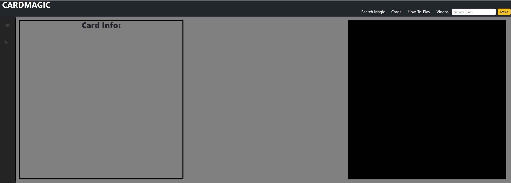
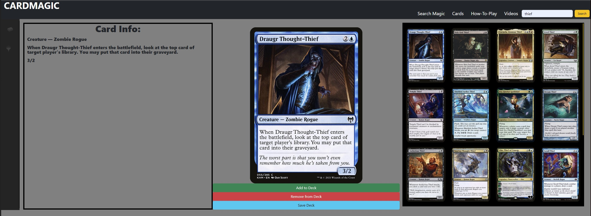

# UNOFFICIAL MTG-Deckbuilder-App

## Description

The purpose of this (obviously fan-made) application is to create a Deckbuilder utility to quickly look-up individual cards and construct a playable decks using them. Users of this application can browse a vast collection of over 18,000 playable MTG cards and compile them into a 60 card deck.

## Installation

N/A

## Usage

Attached to this Github and [linked here](https://aesthetic-justice.github.io/MTG-Deckbuilder-App/) are portals to the application displayed in the image below.

Within the top right corner of the page is a Search Bar. Users can input the name, either partially or fully, of the card(s) they wish to look up. Once complete, the user can click the nearby search button to initiate the search.

Once the search is complete, the black grid below will fill up with the search results, demonstrated below.

The user can scroll through and click any of the displayed cards to add them to the display in the center of the screen for a better look.

When you've decided you'd like to add a card to the deck, the Add, Remove, and Save buttons are a useful and intuitive interface.

Add to Deck: Either introduce a new card to the deck, or increment the amount of this specific card by 1(Max 4)
Remove from Deck: Either remove a card entry completely, or decrement the amount of this specific card by 1.
Save Deck: Save the currently displayed deck to LocalStorage destructively. This means that any previously saved deck will be overwritten. However, this also means that the most recent deck will be automatically loaded when the user returns to this page.

Contained below is a gif, demonstrating the app in use.

The additional tabs contained in the top right corner are;
- Search Magic:
    An embeded google search API
- Cards:
    A display gallery of MTG cards
- How-to-Play:
    A link to a page hosted by Wizards on how to play Magic the Gathering
- Videos:
    A link to the official MTG Youtube page

## Credits

All card art is property of Wizards of the Coast LLC, a subsidiary of Hasbro, Inc. All Rights Reserved, used with permission as per the [Wizards of the Coast Fan Content Policy](https://company.wizards.com/en/legal/fancontentpolicy)

The API used to retrieve the card information is property of [Scryfall](https://scryfall.com/)

Co-Created by Aesthetic-Justice and TRK41

## License

Excluding the attached JSON file, please refer to the LICENSE file attached to this repo for further information.
The JSON file contains trimmed down bulk data retrieved from [Scryfall](https://scryfall.com/), please see their Terms of Use or retrieve your own original copy directly from them.
